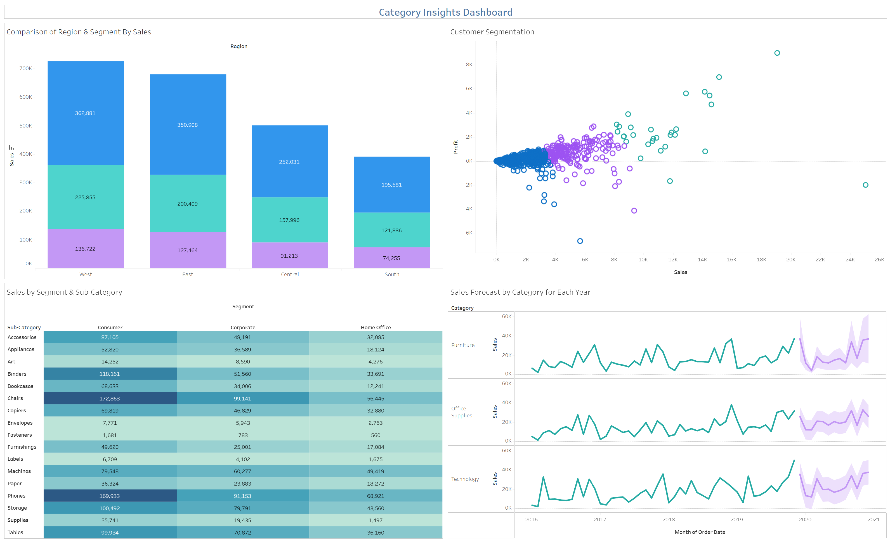

# Tableau_Clustering_&_Forecasting Dashboard 

An interactive sales analytics dashboard built on the **Sample Superstore dataset** — analyzing regional sales performance, customer segmentation, sub-category profitability, and future sales forecasting across Furniture, Office Supplies, and Technology categories.

> Features advanced Tableau analytics — **K-Means Customer Clustering** and **Sales Forecasting**

---

## 🔗 Live Dashboard

[View on Tableau Public](https://public.tableau.com/app/profile/shubham.gupta2025/viz/CategoryInsightsDashboard_17093140961240/Dashboard1)

---

## 📸 Dashboard Preview



---

## 📊 Dashboard Charts

| Chart | Type | Description |
|---|---|---|
| 🌍 Comparison of Region & Segment By Sales | Stacked Bar Chart | Sales across 4 regions split by 3 customer segments |
| 🤖 Customer Segmentation | Scatter Plot (K-Means) | Customers clustered into 3 groups by Sales vs Profit |
| 📋 Sales by Segment & Sub-Category | Text Table | Sub-category sales across Consumer, Corporate & Home Office |
| 📈 Sales Forecast by Category for Each Year | Line Chart + Forecast | Historical + projected sales for Furniture, Office Supplies & Technology |

---

## 📌 Snapshot — Key Numbers

| Metric | Value |
|---|---|
| 🥇 Top Region by Sales | West — $725K+ total |
| 🥈 Second Region | East — $678K+ total |
| 🛋️ Top Sub-Category (Consumer) | Chairs — $172,863 |
| 📱 Second Sub-Category (Consumer) | Phones — $169,933 |
| 📅 Forecast Period | 2020–2021 |
| 🤖 Clustering Method | K-Means (3 Clusters) |

---

## 🧠 Advanced Analytics

### K-Means Customer Segmentation
Customers are automatically grouped into **3 behavioral clusters** based on their Sales and Profit patterns — enabling targeted marketing strategies for high-value, mid-tier, and low-engagement customers.

### Sales Forecasting
Tableau's built-in time-series forecasting model projects sales trends for each category through 2021, with **confidence interval bands** showing the range of expected outcomes.

---

## 📁 Project Structure

```
TABLEAU_CLUSTERING_&_FORECASTING_PROJECT/
├── data/
│   └── Sample - Superstore.xls        # Source dataset
├── tableau/
│   └── Tableau_Clustering_&_Forecasting_Project.twbx  # Tableau workbook
│   └── dashboard.png                  # Dashboard preview
├── README.MD                          # Project overview (this file)
└── analysis_report.md                 # Detailed insights & recommendations
```

---

## 🗃️ Dataset Details

| Field | Description |
|---|---|
| `Order ID / Order Date` | Transaction identifiers and timing |
| `Ship Mode` | Delivery method |
| `Customer Name` | Customer identifier |
| `Segment` | Consumer, Corporate, Home Office |
| `Region` | East, West, Central, South |
| `Category` | Furniture, Office Supplies, Technology |
| `Sub-Category` | 17 sub-categories (Chairs, Phones, Binders, etc.) |
| `Sales` | Revenue per transaction |
| `Quantity` | Units ordered |
| `Discount` | Discount applied |
| `Profit` | Profit per transaction |

---

## 🛠️ Tools Used

| Tool | Purpose |
|---|---|
|  **Tableau Desktop 2025.2** | Dashboard building, K-Means clustering & forecasting |
| **Tableau Public** | Publishing & sharing |
| **Microsoft Excel (.xls)** | Source data format |
| **VS Code** | Project management & GitHub workflow |
| **Git & GitHub** | Version control |

---

## 💡 Key Takeaways

- 🌍 **West dominates** all regions with $725K+ in total sales across all segments
- 🛋️ **Chairs and Phones** are the top-selling sub-categories across every customer segment
- 🤖 K-Means clustering reveals **3 distinct customer profiles** — from high-value outliers to low-engagement buyers
- 📈 All 3 categories show an **upward sales forecast** through 2021, with Technology leading growth
- ⚠️ Tables show high sales volume but thin margins — a key area for **discount policy review**

> For chart-level insights, cluster analysis, and sub-category recommendations, see [analysis_report.md](analysis_report.md)

---

## 👤 Author

**Shubham Gupta**
[Tableau Public Profile](https://public.tableau.com/app/profile/shubham.gupta2025),
[LinkedIn](https://www.linkedin.com/in/theshubhamguptaa/),
Gmail - gshubham7557@gmail.com

